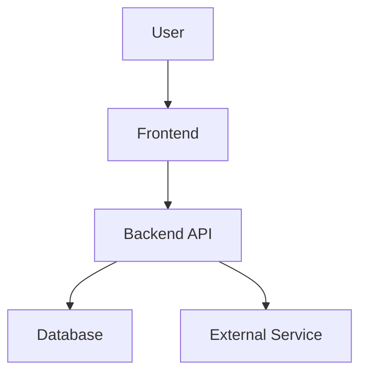

# Technical Design: {{FEATURE_NAME}}

> Companion to: [[PRD: {{FEATURE_NAME}}]]

## Summary

One paragraph: what are we building and what's the high-level technical approach?

## Context & Constraints

- **Timeline**: —
- **Team**: Who is building this?
- **Dependencies**: External services, APIs, or teams we depend on
- **Non-functional requirements**: Latency budget, throughput target, availability SLA

## Architecture

### System Context (C4 Level 1)

How does this feature fit into the existing system? What external systems does it interact with?



### Component Design (C4 Level 3)

What new components, modules, or services are needed?

| Component | Location | Responsibility |
|-----------|----------|----------------|
| — | `packages/frontend/src/features/...` | — |
| — | `packages/backend/src/modules/...` | — |
| — | `packages/core/src/...` | — |

### API Design

New or modified endpoints:

```
METHOD /api/v1/resource
  Request: { field: type }
  Response: { field: type }
  Errors: 400, 401, 403, 404, 429
```

Update `specs/api.openapi.yaml` with the full contract.

### Data Model

New tables, columns, or migrations:

```sql
CREATE TABLE feature_name (
    id UUID PRIMARY KEY DEFAULT gen_random_uuid(),
    created_at TIMESTAMPTZ NOT NULL DEFAULT now(),
    updated_at TIMESTAMPTZ NOT NULL DEFAULT now()
);
```

#### Data Migration

- Is there existing data to migrate?
- Can the migration run without downtime?
- What's the rollback procedure?

### State Management (Frontend)

| State | Type | Location |
|-------|------|----------|
| Server data | TanStack Query | `useFeatureQuery()` |
| Form state | React Hook Form / local | Component |
| URL state | Search params | Router |

## Alternatives Considered

### Option A: [Chosen approach]

- **Pros**: —
- **Cons**: —

### Option B: [Rejected approach]

- **Pros**: —
- **Cons**: —
- **Why rejected**: —

## Test Strategy

### Unit Tests

| Module | What to test | Framework |
|--------|-------------|-----------|
| — | — | Vitest |

### Integration Tests

| Flow | What to test | Framework |
|------|-------------|-----------|
| — | — | Vitest + MSW |

### E2E Tests

| Scenario | Critical path? | Framework |
|----------|---------------|-----------|
| — | Yes/No | Playwright |

### Test Boundaries

What is NOT worth testing and why?

## Rollout Plan

- [ ] Feature flag: `feature_name_enabled` (default: off)
- [ ] Internal dogfood: Team uses for 1 week
- [ ] Canary: 5% of users for 48 hours
- [ ] Staged rollout: 25% → 50% → 100%
- [ ] Monitor: [specific metrics to watch]
- [ ] Kill switch: How to disable immediately if issues arise

## Observability

| Signal | What | Tool |
|--------|------|------|
| Metric | — | — |
| Log | — | — |
| Trace | — | — |
| Alert | — | — |

## Security Considerations

- [ ] Authentication: How is the user identified?
- [ ] Authorization: What permissions are required?
- [ ] Input validation: What inputs need sanitization?
- [ ] PII: Does this feature handle personal data?
- [ ] Rate limiting: Is abuse prevention needed?

## Open Questions

- [ ] Question 1 — Owner: —, Deadline: —
- [ ] Question 2 — Owner: —, Deadline: —

## References

- PRD: `docs/plans/YYYY-MM-DD-feature-name.md`
- ADRs: Link relevant architecture decisions
- External docs: API references, library docs
